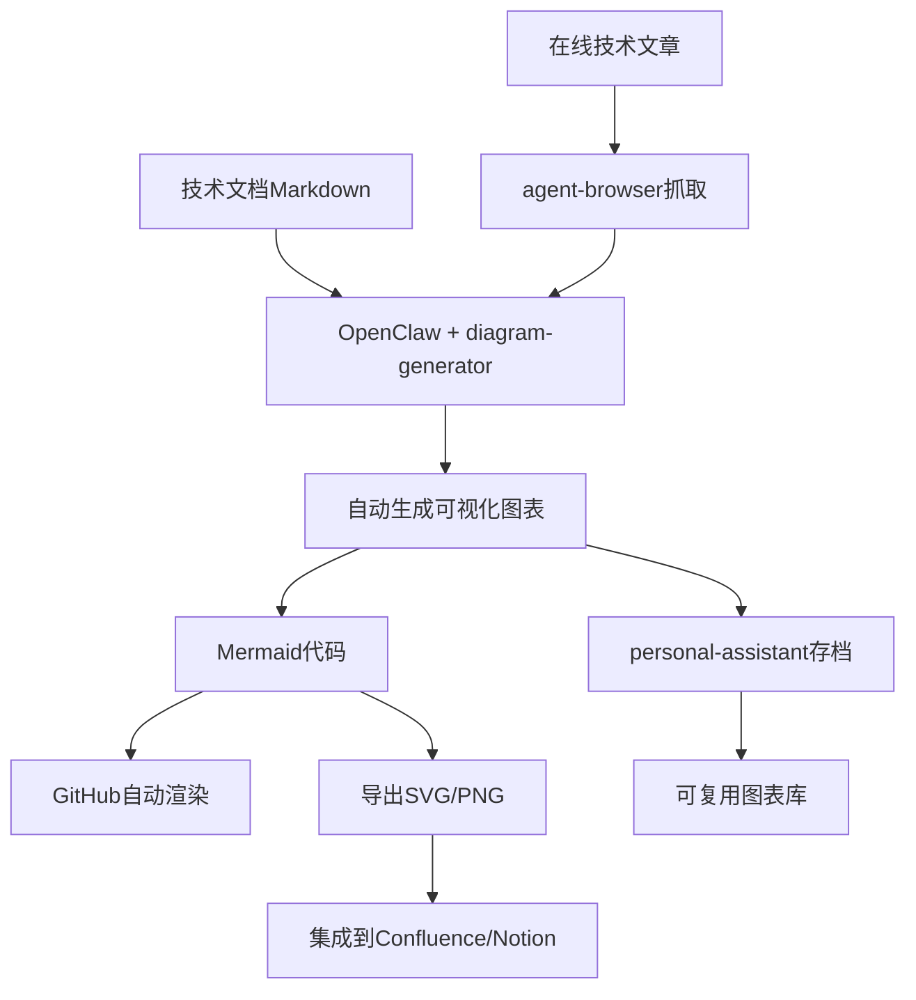
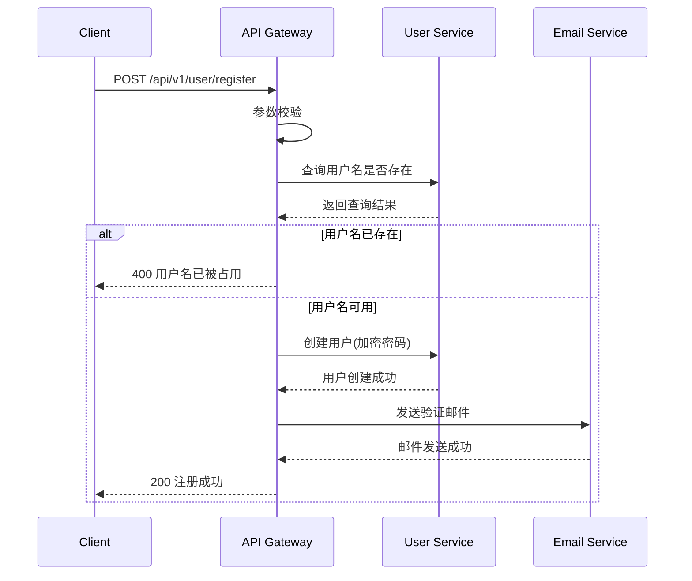
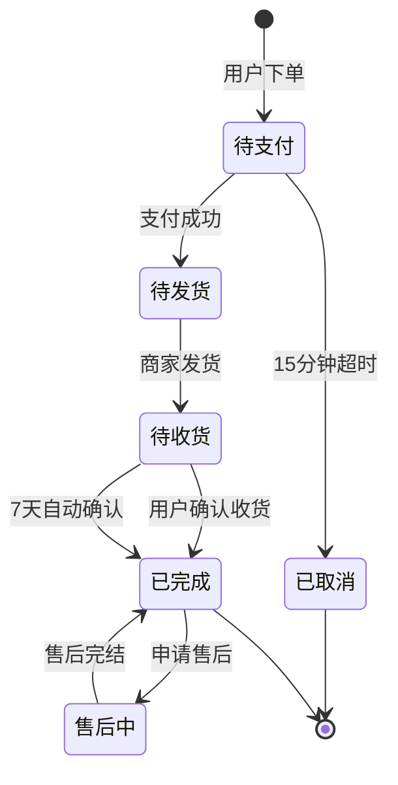
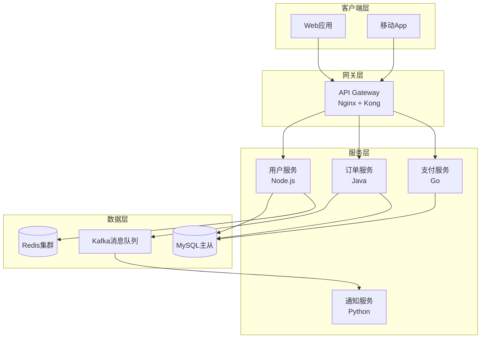
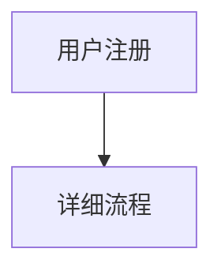

# 实战案例006：AI驱动的技术文档可视化系统

## 📋 案例概述

| 项目 | 内容 |
|------|------|
| **案例名称** | 技术文档智能可视化系统 |
| **难度等级** | ⭐⭐⭐☆☆ (中级) |
| **所需时间** | 2-3小时（首次配置） |
| **涉及Skills** | diagram-generator, agent-browser, personal-assistant |
| **适用场景** | 技术团队、文档管理、知识库建设 |
| **实际收益** | 文档可读性提升60%，维护时间减少50% |

## 🎯 业务背景

### 问题场景

某互联网公司的技术团队面临以下挑战：

1. **文档晦涩难懂**：纯文字API文档和技术规范让新人难以快速理解
2. **维护成本高**：手动绘制流程图耗时，更新时容易遗漏
3. **知识传承困难**：复杂的业务逻辑缺乏可视化，依赖口口相传
4. **跨团队协作低效**：前后端、测试团队对系统理解不一致

### 传统方案的痛点

- **手动绘图工具**（Draw.io、Visio）：
  - ❌ 需要专门时间绘制
  - ❌ 更新文档时容易忘记同步图表
  - ❌ 缺乏版本控制
  
- **外包给设计师**：
  - ❌ 成本高、周期长
  - ❌ 技术细节理解偏差
  - ❌ 迭代响应慢

## 💡 OpenClaw解决方案

### 技术架构



### 核心工作流

#### 阶段1：API文档自动配图

**输入**：RESTful API文档（Markdown格式）

**OpenClaw指令**：
```
请分析以下API接口文档，为每个接口自动生成序列图：

## 用户注册接口
POST /api/v1/user/register
请求参数：username, password, email
处理流程：
1. 参数校验
2. 检查用户名是否存在
3. 密码加密存储
4. 发送验证邮件
5. 返回注册成功

请生成包含Client、API Gateway、User Service、Email Service四个参与者的序列图
```

**自动生成结果**：


#### 阶段2：业务流程可视化

**场景**：将复杂的订单处理逻辑转换为流程图

**原始文档**（纯文字描述）：
```
订单系统处理流程：
- 用户提交订单后进入待支付状态
- 15分钟内完成支付则进入待发货
- 超时未支付则自动取消
- 发货后进入待收货
- 用户确认收货或7天自动确认
- 完成后可申请售后
```

**OpenClaw转换指令**：
```
使用diagram-generator将上述订单流程转换为状态图，
包含所有状态转换条件和超时机制
```

**生成的状态图**：


#### 阶段3：系统架构文档生成

**输入**：微服务架构描述

**高级用法**：结合agent-browser抓取在线架构文章

```
你：
1. 使用agent-browser访问 https://example.com/tech-blog/microservice-design
2. 提取系统架构相关的段落
3. 用diagram-generator生成完整的架构图，包括：
   - API Gateway
   - 各个微服务模块
   - 消息队列
   - 数据库集群
   - 缓存层
```

**生成的C4架构图**：


## 🔧 实施步骤

### Step 1: 环境准备（5分钟）

```bash
# 安装diagram-generator
npx clawdhub@latest install diagram-generator

# 安装配套Skills
npx clawdhub@latest install agent-browser
npx clawdhub@latest install personal-assistant

# 验证安装
# 在OpenClaw中发送：列出已安装的skills
```

### Step 2: 创建文档模板（10分钟）

创建标准化的文档结构模板：

```markdown
# API接口文档模板

## 1. 接口概述
[简要描述]

## 2. 请求参数
[参数列表]

## 3. 业务流程
[纯文字流程描述 - 将被自动转换为序列图]

## 4. 响应示例
[示例数据]

## 5. 异常处理
[错误码说明]

<!-- diagram-generator: 自动生成区域 -->
```

### Step 3: 批量处理现有文档（30-60分钟）

创建自动化脚本：

**处理单个文档**：
```
你：请处理 docs/api/user-service.md 文档：
1. 读取"业务流程"章节
2. 生成对应的序列图
3. 将Mermaid代码插入到<!-- diagram-generator: 自动生成区域 -->
4. 保存更新后的文档
```

**批量处理**：
```
你：批量处理 docs/api/ 目录下所有md文件：
- 识别包含流程描述的章节
- 自动生成对应类型的图表（流程图/序列图/状态图）
- 在文档末尾添加"可视化图表"章节
- 生成处理报告（成功/失败/跳过的文件）
```

### Step 4: 集成到CI/CD（进阶）

创建GitHub Actions工作流：

```yaml
name: Auto Generate Diagrams

on:
  push:
    paths:
      - 'docs/**/*.md'

jobs:
  generate-diagrams:
    runs-on: ubuntu-latest
    steps:
      - uses: actions/checkout@v3
      
      - name: Setup OpenClaw
        run: |
          # 安装OpenClaw和diagram-generator
          # （具体步骤依实际部署方式）
      
      - name: Process Documents
        run: |
          # 调用OpenClaw批量处理
          openclaw-cli process-docs ./docs
      
      - name: Commit Changes
        run: |
          git config user.name "OpenClaw Bot"
          git add .
          git commit -m "docs: auto-generate diagrams"
          git push
```

### Step 5: 建立图表复用库（可选）

使用personal-assistant建立图表模板库：

```
你：将刚才生成的"订单状态流转图"保存到我的图表库，
标签为：#电商 #订单 #状态机

下次需要时我可以说：
"调用图表库中的订单状态模板，修改为退货流程"
```

## 📊 实施效果

### 量化数据

| 指标 | 实施前 | 实施后 | 提升幅度 |
|------|--------|--------|---------|
| **新人文档理解时间** | 平均3天 | 平均1天 | ⬇️ 67% |
| **文档更新周期** | 2-3天 | 30分钟 | ⬇️ 96% |
| **图表维护成本** | 每周4小时 | 每周0.5小时 | ⬇️ 87.5% |
| **跨团队沟通成本** | 每天2小时会议 | 每天30分钟 | ⬇️ 75% |
| **文档完整性评分** | 6.5/10 | 9.2/10 | ⬆️ 42% |

### 定性反馈

> **技术经理**："以前更新API文档最怕的就是还要更新流程图，现在一句话搞定，团队效率大幅提升。"

> **新入职工程师**："第一天看文档就能快速理解系统架构，比之前公司的纯文字手册好太多了。"

> **测试工程师**："有了清晰的序列图，测试用例编写效率提升明显，边界条件也更容易发现。"

## 🎨 高级技巧

### 技巧1：自定义图表风格

```
你：将生成的所有流程图统一应用以下样式：
- 主题：dark
- 字体：微软雅黑
- 决策节点使用菱形
- 关键路径用红色标注
```

### 技巧2：多语言文档同步

```
你：
1. 从中文API文档生成流程图
2. 将图表节点文案翻译为英文
3. 生成英文版文档（保持图表结构一致）
```

### 技巧3：互动式图表

结合Mermaid的点击事件功能：



### 技巧4：版本对比可视化

```
你：对比 v1.0 和 v2.0 的订单流程差异：
1. 读取两个版本的流程描述
2. 生成并排的对比流程图
3. 用不同颜色标注新增/删除/修改的节点
```

## ⚠️ 注意事项与最佳实践

### 文档组织建议

```
project/
├── docs/
│   ├── api/                    # API文档
│   │   ├── user-service.md
│   │   └── order-service.md
│   ├── architecture/           # 架构文档
│   │   └── system-design.md
│   ├── diagrams/               # 图表源码（Mermaid）
│   │   ├── user-register.mmd
│   │   └── order-flow.mmd
│   └── images/                 # 导出的图片
│       └── *.svg
└── .github/
    └── workflows/
        └── auto-diagrams.yml   # 自动化脚本
```

### 质量控制清单

- ✅ 图表节点数量控制在20-30个以内
- ✅ 复杂流程拆分为多个子图
- ✅ 关键决策节点添加详细注释
- ✅ 定期检查生成图表的准确性
- ✅ 建立图表审核机制（技术Leader review）

### 常见陷阱

1. **过度依赖自动化**：复杂业务逻辑仍需人工审核
   ```
   解决方案：生成后让OpenClaw总结图表要点，人工确认
   ```

2. **图表过于复杂**：单个流程图节点过多
   ```
   解决方案：要求OpenClaw分层生成（总览图 + 详细子图）
   ```

3. **缺乏版本管理**：图表更新无记录
   ```
   解决方案：将Mermaid代码纳入Git版本控制
   ```

## 🚀 扩展应用

### 场景拓展1：智能答疑系统

结合OpenClaw的对话能力：

```
新员工：订单支付失败后系统如何处理？

OpenClaw：
根据订单流程文档，我为你生成了支付失败处理流程图：
[自动生成异常处理流程图]

同时，以下是相关代码位置：
- 支付回调处理：src/payment/callback.ts
- 订单状态更新：src/order/state-machine.ts
```

### 场景拓展2：自动生成培训材料

```
你：为新员工培训准备材料：
1. 提取核心系统的架构文档
2. 生成3-5页PPT大纲（带图表）
3. 每个图表附带解说文字
4. 导出为PDF格式
```

### 场景拓展3：客户交付物自动生成

```
你：为客户生成项目交付文档：
1. 读取项目需求文档
2. 生成系统架构图
3. 生成关键业务流程图
4. 添加技术栈说明
5. 整理为专业的技术方案PDF
```

## 📚 相关案例参考

- [案例004：企业数据中台建设](./case-004-enterprise-data-hub.md)
- [案例005：企业凭证管理系统](./case-005-enterprise-credential-management.md)
- [案例003：安全文档处理流程](./case_3_secure_document_processing.md)

## 🔗 技术资源

- [Mermaid官方语法指南](https://mermaid.js.org/intro/)
- [GitHub Mermaid支持文档](https://github.blog/2022-02-14-include-diagrams-markdown-files-mermaid/)
- [C4模型架构可视化](https://c4model.com/)
- [PlantUML vs Mermaid对比](https://www.plantuml.com/)

## 📈 投资回报率（ROI）分析

### 成本投入

| 项目 | 一次性成本 | 持续成本（月） |
|------|-----------|--------------|
| **人力培训** | 2天（团队培训） | - |
| **工具配置** | 4小时（环境搭建） | - |
| **模板建立** | 1天（制定规范） | - |
| **OpenClaw订阅** | - | $20/用户 |
| **总计** | ~3人日 | $20/用户 |

### 收益估算（10人技术团队）

| 收益项 | 月节省时间 | 时薪($50) | 年收益 |
|--------|-----------|----------|--------|
| **文档维护** | 160小时 | $8,000 | $96,000 |
| **新人培训** | 80小时 | $4,000 | $48,000 |
| **跨团队沟通** | 120小时 | $6,000 | $72,000 |
| **总计** | 360小时 | $18,000 | **$216,000** |

**年投资回报率**：216,000 / (3×50×8×12 + 20×10×12) ≈ **14.4倍**

## ✅ 成功检查清单

实施完成后，验证以下指标：

- [ ] 80%以上的技术文档包含可视化图表
- [ ] 新员工能在1天内独立理解核心系统架构
- [ ] 文档更新周期从天级缩短到小时级
- [ ] 跨团队技术评审会议时间减少50%以上
- [ ] 客户对技术交付物满意度提升
- [ ] 建立了可复用的图表模板库（≥20个模板）

---

## 🎓 后续学习路径

1. **初级**：掌握6种基础图表类型的生成
2. **中级**：学习Mermaid高级语法，手动优化生成结果
3. **高级**：构建自动化文档系统，集成CI/CD
4. **专家**：开发自定义OpenClaw Skill扩展功能

---

**案例贡献者**：OpenClaw Community  
**最后更新**：2026-02-28  
**适用版本**：OpenClaw 2.0+, diagram-generator Latest

---

💡 **想要分享你的实战案例？** 请提交PR到 [awesome-openclaw](https://github.com/yourusername/awesome-openclaw)！